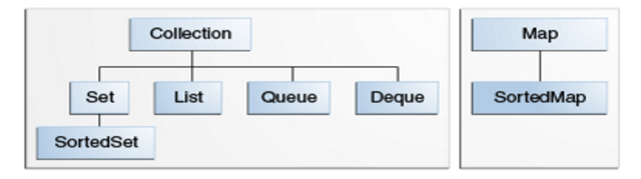

# Java Collections: Dominando Listas, Sets e Mapas

## Trabalhando com ArrayList

- `ArrayList<String> aulas = new ArrayList<>();`
- `aulas.add("Aula 1");`
- `aulas.remove(0);`
- `aulas.get(0);`
- `aulas.size();`
- `Collections.sort(aulas);`

## Lista de objetos

Diferente de uma `String` ou de tipos primitivos mais simples, o `Collections.sort` não sabe ordenar uma lista de `Aula`. De qual forma ele faria isso? Pelo nome da aula? Pela duração? Não daria para saber. Para que ele seja capaz de fazer isso, você precisa implementar a interface Comparable definindo um critério de comparação para os objetos desse tipo. 

```
public class Aula implements Comparable<Aula> {

    private String titulo;
    private int tempo;

    public Aula(String titulo, int tempo) {
        this.titulo = titulo;
        this.tempo = tempo;
    }

    public String getTitulo() {
        return titulo;
    }

    public int getTempo() {
        return tempo;
    }

    @Override
    public String toString() {
        return "[Aula: " + this.titulo + ", " + this.tempo + " minutos]";
    }

    @Override
    public int compareTo(Aula outraAula) {
        return this.titulo.compareTo(outraAula.getTitulo());
    }
}
```

### Ordenando com Java 8

```
aulas.sort(Comparator.comparing(Aula::getTempo));
```
`
## Relacionamentos com coleções

- `Collections.unmodifiableList` - retorna uma lista imutável, boa prática para **encapsular** listas dentro de uma classe.

### Diferença entre ArrayList e LinkedList

- `ArrayList` usa uma array internamente para guardar os elementos. Ela consegue fazer umas operações de maneira muito eficiente, como invocar o método `get(indice)`. Porém, ela é lenta quando, por exemplo, quiser adicionar um elemento na primeira posição. Pois a implementação vai precisar mover todos os elementos que estão no começo para a próxima posição. Em computação isso é conhecido por **consumo de tempo linear**.
- `LinkedList` utiliza a estrutura de dados chamada lista ligada. Ela é muito rápida para adicionar e remover elementos na *cabeça* da lista. Mas ela é lenta se você precisar acessar um determinado elemento, pois a implementação precisará percorrer todos os elementos até chegar ao índice desejado.

### Outros métodos de Collections

- `Collections.reverse()` - inverte a ordem de uma lista.
- `Collections.shuffle()` - embaralha a ordem de uma lista.
- `Collections.singletonList()` - devolve uma lista imutável que contêm um único elemento especificado. Ele é útil quando precisamos passar um único elemento para uma API que só aceita uma Collections daquele elemento.
- `Collections.nCopies()` - retorna uma lista imutável com a quantidade escolhida de um determinado elemento. Se temos uma lista específica e precisamos obter uma outra lista imutável, contendo diversas cópias de um destes objetos, utilizamos este método. O bom deste método é que mesmo que nós solicitemos uma lista com um número grande, como 1000 objetos, ele na verdade se referencia a apenas um, ocupando assim um pequeno espaço. Este método também é utilizado para inicializar listas recém criadas com `null`, já que ele pode rapidamente criar diversos objetos, deste modo:
`List<Type> lista = new ArrayList<Type>(Collections.nCopies(1000, (Type) null));`.

## O poder dos sets

Herança das interfaces, dentro da API de coleções:



- Um `Set` garante que nenhum elemento se repete. Por isso o método `add(...)` devolve um booleano que indica o sucesso da inserção.
- Há métodos que fazem busca por um objeto, como `contains(...)` ou `remove(...)`, que são muito mais rápidos se comparado com uma lista.
- Um conjunto (Set) não garante a ordem de inserção. Diferentemente de uma lista, um conjunto não define uma ordem. Isso significa que não recebemos os elementos na mesma ordem de inserção.

### Teste de velocidade de busca das listas e conjuntos

Exemplo de código:

```
public class TestaPerformance {

    public static void main(String[] args) {

        Collection<Integer> numeros = new ArrayList<Integer>();
        //Collection<Integer> numeros = new HashSet<>();

        long inicio = System.currentTimeMillis();

        for (int i = 1; i <= 50000; i++) {
            numeros.add(i);
        }

        for (Integer numero : numeros) {
            numeros.contains(numero);
        }

        long fim = System.currentTimeMillis();

        long tempoDeExecucao = fim - inicio;

        System.out.println("Tempo gasto: " + tempoDeExecucao);

    }

}
```

No caso do `ArrayList`, a inserção é bem rápida e a busca **muito lenta**!

No caso do `HashSet`, a inserção ainda é rápida, embora um pouco mais lenta do que a das listas. Mas a busca é **muito rápida**!

### Coleções threadsafe

Uma das características mais interessantes da JVM é que ela sabe trabalhar em paralelo. Internamente isso é feito por meio de **Threads** que funcionam como pequenos processos dentro da JVM.

O problema é que as coleções que estamos usando até agora não foram feitas para serem manipuladas em paralelo. No entanto, nada impede que usemos um método da classe Collections para transformar uma coleção comum em uma coleção para threads. É justamente isso que o método faz, retorna um nova coleção que pode ser compartilhada entre threads sem perigos.

```
Set<Aluno> alunosSincronizados = Collections.synchronizedSet(alunos);
```

## Equals e hashcode

- Sempre que reescrever o método `equals`, reescreva o método `hashCode` também.
- O `contains` utiliza a estrutura bem implementada da **tabela de espalhamento**.
- Existe um [contrato](https://docs.oracle.com/javase/8/docs/api/java/lang/Object.html#equals-java.lang.Object-) mais avançado que devemos seguir para implementar um método `equals` eficiente.

## Outros sets e iterators

- `LinkedHashSet` - Performance de um HashSet mas com acesso previsível e ordenado.
- `TreeSet` - Para adicionar um objeto em um TreeSet ele precisa implementar a interface `Comparable`. Mas o que fazer se estamos trabalhando com uma instância de uma classe que não temos acesso ou não podemos modificar para implementar `Comparable`? Nesse caso, o construtor do `TreeSet` recebe como parâmetro um objeto que implementa `Comparator`. Dessa forma, o critério de comparação pode ser criado em separado da classe na qual opera.

### Iterator

Para percorrer uma `Collection` em **Java 8** usando o método `forEach`. Por exemplo:

```
Set<String> conjunto = new HashSet<>();
conjunto.add("A");
conjunto.add("A"); // não adiciona, já existe
conjunto.add("B");

conjunto.forEach(letra -> {
    System.out.println(letra);
});
```

Antes do **Java 8** usávamos:

```
for(String letra: conjunto) {
    System.out.println(letra);
}
```

No entanto, voltando ao passado mais longínquo, mais propriamente antes do **Java 5**, essa estrutura não existia. Se não existia, como era possível iterar em um conjunto (Set) se ele não possui acesso indexado como uma lista que possui o método get? Percorríamos uma lista através de um `Iterator`!

É um objeto que todas as coleções nos dão acesso e serve para iterar entre os objetos dentro da coleção. A ordem na qual os elementos são devolvidos pelo Iterator depende da implementação da `Collection` utilizada.

Por exemplo:

```
Set<Aluno> alunos = javaColecoes.getAlunos();
Iterator<Aluno> iterador = alunos.iterator();

while (iterador.hasNext()) {
    System.out.println(iterador.next());
}
```

A classe `Vector` possui as mesmas características que um `ArrayList`, com diferença de que o primeiro possui acesso sincronizado (**thread-safe**) e o segundo não. **_Mas não é mais utilizado atualmente_**.

## Mapas

- `Map` não é uma implementação de `Collection`, ele é uma interface por si só.
- Mapa é muito bom para fazer associações.
- `HashMap` e `LinkedHashMap` são implementações de `Map`.
- O método utilizado para adicionar um elemento em um `Map` é o método `put`. Ele recebe dois parâmetros, a **chave** e o **valor**. Os tipos desses parâmetros dependem do que definimos na hora da instância do objeto. 

### Iterando sobre um mapa

Podemos utilizar o `forEach` do Java 8 para iterar pelo conjunto de chaves que é retornado pelo método `keySet()P . Depois, para cada chave idade, nós pegamos o seu valor através do método get e imprimimos:

```
public class Exercicio {

    public static void main(String[] args) {

        Map<Integer, String> pessoas = new HashMap<>();

        pessoas.put(21, "Leonardo Cordeiro");
        pessoas.put(27, "Fabio Pimentel");
        pessoas.put(19, "Silvio Mattos");
        pessoas.put(23, "Romulo Henrique");

        pessoas.keySet().forEach(idade -> {
            System.out.println(pessoas.get(idade));
        });

    }
}
```

### Chaves e Valores

Segundo o JavaDoc, um `Map` também pode ser visto como se fossem de 3 coleções:

>*The Map interface provides three collection views, which allow a map's contents to be viewed as a set of keys, collection of values, or set of key-value mappings.*

Ou seja, temos uma coleção de chaves, uma coleção de valores, e uma coleção das associações. O interessante é que podemos acessar cada uma das coleções. Vamos tentar?

No editor abaixo já temos um Map preparado que associa o nome do aluno com a idade.

Para acessar apenas as chaves use o método `keySet()` do Map. Para acessar os valores existe o método `values()`.

Para acessar as chaves devemos executar:

```
Set<String> chaves = nomesParaIdade.keySet();
for (String nome : chaves) {
    System.out.println(nome);
}
```

E para pegar os valores usamos:

```
Collection<Integer> valores = nomesParaIdade.values();
for (Integer idade : valores) {
    System.out.println(idade);
}
```

Agora só falta a terceira coleção que devolve a associação. Para tal, existe o método `entrySet()` e cada associação é representado através da classe `Entry`:

```
Set<Entry<String, Integer>> associacoes = nomesParaIdade.entrySet();
```

Repare que o método devolve um `Set` de `Entry`. Para acessar essa coleção basta usar o `foreach`:

```
Set<Entry<String, Integer>> associacoes = nomesParaIdade.entrySet();
for (Entry<String, Integer> associacao : associacoes) {
    System.out.println(associacao.getKey() + " - " + associacao.getValue());
}
```

## Links de referência

- [Página do curso](https://cursos.alura.com.br/course/java-collections)
- [Projeto final](https://github.com/alura-cursos/JavaCollections/archive/final.zip)

---

[Voltar](./README.md)
